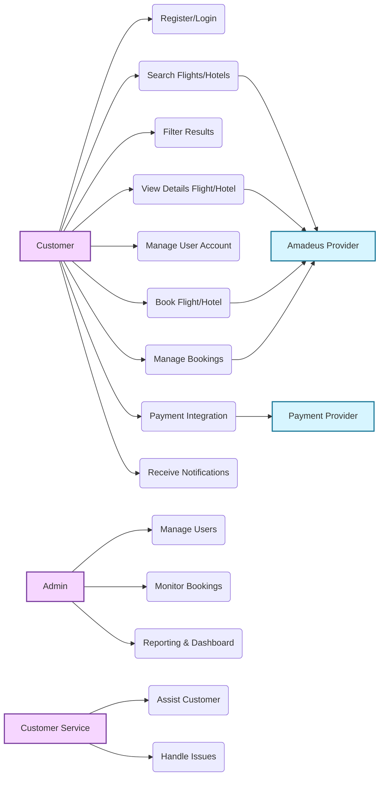
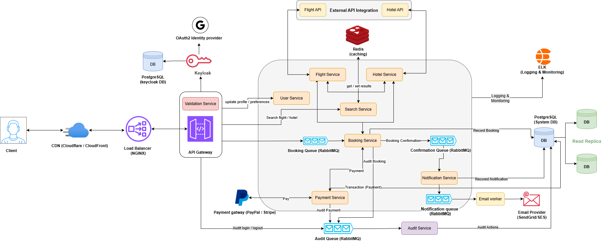

# Booking (Hotel/Flight) Platform

## Content List

1. [Vision](#vision)
2. [Features and Functionalities for the System](#features-and-functionalities-for-the-system)
3. [Use Case Model for the System](#use-case-model-for-the-system)  
   3.1. [Actors](#actors-of-the-system)  
   3.2. [Main use cases](#main-use-cases)  
   3.3. [Use Case Diagram](#use-case-diagram)
4. [System Architecture](#system-architecture)
---

## Vision  

The booking platform is designed to provide travelers with a seamless and intuitive experience when planning their trips. Users can easily search for hotels and flights, compare available options, and complete their bookings quickly and without complications. The platform also allows customers to manage their reservations, access exclusive deals, and benefit from secure and reliable payment processing tailored to their travel needs.

The system integrates directly with **Amadeus APIs** to retrieve real-time flight schedules, fares, hotel availability, room details, and to process booking operations securely.

Additionally, customers enjoy secure payments, booking management, and notifications throughout their travel journey.

---

## Features and Functionalities for the System 

The detailed list of system features and functionalities is available in a separate document:  
Please refer to [Features and Functionalities Document](./features-functions-doc.md) for more details.

---

## Non-Functional Requirements

This section defines the quality attributes required to operate the booking platform reliably at scale.

### Scalability

* Horizontal scaling supported via **stateless NestJS modules**
* Asynchronous workloads handled using **RabbitMQ**
* Redis used to reduce load on Amadeus APIs
* Read replicas for PostgreSQL to scale read operations

### Availability & Reliability

* Target availability: **99.9%**
* Graceful degradation when external providers are unavailable
* Retry mechanisms and **DLQ** for message failures
* Idempotent booking and payment operations

### Performance

* Flight/Hotel search response time < **2 seconds**
* Cached search results using Redis
* Asynchronous notifications and reporting

### Security

* OAuth2 / OIDC via **Keycloak**
* PCI-sensitive data handled only by payment providers
* Secure secrets via AWS environment configuration
* HTTPS enforced via Nginx

### Observability

* Centralized logging via **ELK Stack**
* Audit trails for booking & payment operations
* Metrics and alerts for failures and queue backlogs

---

## Use Case Model for the System 

### `Actors of the System` 

| **Actor**                                                        | **Description**                                                                        | **Responsibilities**                                                                                                                                                                                                                                                                                         |
| ---------------------------------------------------------------- | -------------------------------------------------------------------------------------- | ------------------------------------------------------------------------------------------------------------------------------------------------------------------------------------------------------------------------------------------------------------------------------------------------------------ |
| **Customer**                                      | End-user of the platform who books hotels or flights. Can be a traveler or local user. | - Search and book hotels/flights - Complete bookings - Manage existing bookings (view, modify, cancel) - Make payments and request refunds - Submit ratings/reviews - Manage personal profile, preferences, and account settings                                                                                              |
| **Amadeus Provider (External System)** | The core external API provider for flights & hotels. | - Provide flight schedules, fares, availability - Provide hotel availability, room offers, and rates - Create flight orders (PNR), hotel bookings - Return booking status, cancellation rules & policies |
| **Payment Provider (PayPal, Stripe, etc.)** | External service provider that processes customer payments.                            | - Handle payment authorization, capture, settlement, and refunds - Provide transaction receipts and status updates - Support fraud detection and dispute management                                                                             |
| **Administrator (Platform Admin)**                               | Internal role managing overall system operations and compliance.                       | - Manage customers, suppliers, and internal users - Oversee listings, disputes, promotions, and refunds - Ensure compliance with licenses, policies, and legal requirements - Monitor financial reports and fraud prevention - Generate dashboards and analytics reports                         |
| **Customer Service**                                             |  Support team assisting users.                        | - Resolve customer issues - Handle cancellation/refund inquiries - Assist with booking problems - Escalate technical issues |

---

### `Main use cases` 
### **1. User Registration & Authentication**: 
   * Create User Account
   * Login
   * Logout
   * Get User Profile
   * Update user profile
   * Enable / Disable account
   * Verify Account [Email]
   * Social Login
     
### **2. Search & Filter (Amadeus)**:
   #### **Flights**
   * Search flights (Amadeus Flight Offers Search API)
   * Get flight offer details
   * Filter by stops, airlines, durations, price range
   * View fare rules & baggage info (from Amadeus)
   
   #### **Hotels**
   * Search hotels (Hotel Search API)
   * List available room offers
   * Get hotel details (amenities, images, rating)
   * Filter by price, category, amenities, location
   * Get room rate details with cancellation rules

         
 ### **3. Booking (Amadeus Order Management)**: 
   #### **Flight Booking**
   
   * Create flight order (PNR creation)
   * Confirm booking
   * Retrieve booking details
   * Cancel flight order (if supported by airline)
   * Get ticketing details (if applicable)
   
   #### **Hotel Booking**
      
   * Create hotel booking (Hotel Booking API)
   * Retrieve booking
   * Cancel booking
   * View cancellation policy & penalties
   
   #### **Booking Management**
   
   * Booking summary
   * Booking history
   * PDF or email confirmation
      
 ### **4. Notification System**: 
 * Send Email or SMS confirmation
 * Booking updates
 * Offers & promotions
 * Opt-in/opt-out notification management
  
 ### **5. Customer Management**: 
 * Preferred Payment Setting
 * Flight/hotel booking History
 * Rating/Review
 * Customer support [Chat]

 ### **6. Payment Integration**: 
 * Payment Integration With third Party
 * View Payment History
 * Generate Payment Recipt
 * Auditing Payment Integration
 * Payment Verification
      
 ### **7. Dashboard & Reporting [System]**: 
 * Total customers
 * Daily/Monthly hotel & flight bookings
 * Canceled bookings statistics
 * Daily/Total amount of transactions
 * Generate Daily/Monthly Transactions Report

### `Use Case Diagram` 

---

## System Architecture

This diagram illustrates the high-level architecture of the booking platform, showing how clients interact with the system through the API Gateway and how core services such as search, booking, payment, and notifications communicate using asynchronous messaging. It also highlights integrations with external providers, caching, databases, logging, and auditing components to ensure scalability, resilience, and observability.

