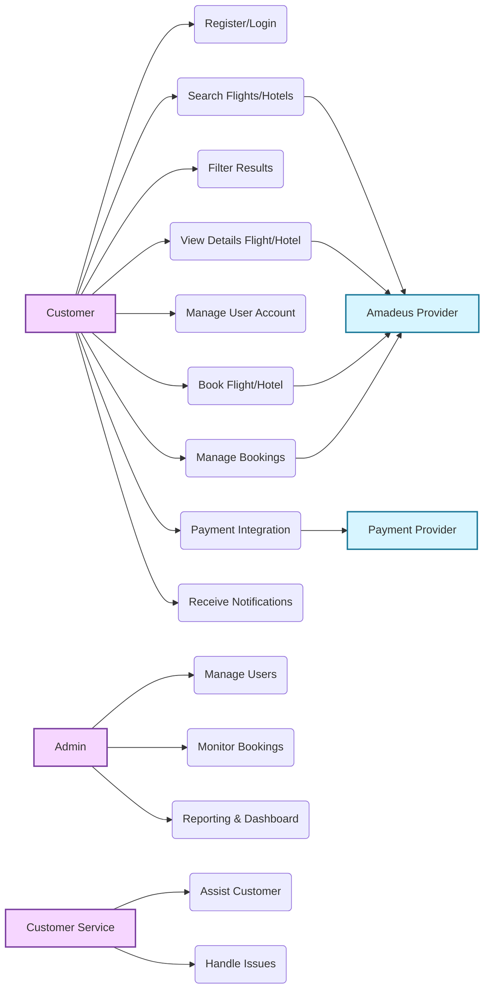

# Booking (Hotel/Flight) Platform

## Content List

1. [Vision](#vision)
2. [System Overview](#system-overview)
   2.1. [System Description](#system-description)
   2.2. [System Scope](#system-scope)
   2.3. [Out of Scope](#out-of-scope)
   2.3. [System Actors](#system-actors)
   2.4. [High-Level Architecture Overview](#high-level-architecture-overview)
   2.5. [Core System Modules](#core-system-modules)
   2.6. [External Integrations](#external-integrations)
3. [Features and Functionalities for the System](#features-and-functionalities-for-the-system)
4. [Non-Functional Requirements](#non-functional-requirements)
5. [Assumptions and Constraints](#assumptions-and-constraints)
6. [Use Case Model for the System](#use-case-model-for-the-system)  
   6.1. [Actors](#actors-of-the-system)  
   6.2. [Main use cases](#main-use-cases)  
   6.3. [Use Case Diagram](#use-case-diagram)
7. [System Architecture](#system-architecture)
---

## Vision  

The booking platform is designed to provide travelers with a seamless and intuitive experience when planning their trips. Users can easily search for hotels and flights, compare available options, and complete their bookings quickly and without complications. The platform also allows customers to manage their reservations, access exclusive deals, and benefit from secure and reliable payment processing tailored to their travel needs.

The system integrates directly with **Amadeus APIs** to retrieve real-time flight schedules, fares, hotel availability, room details, and to process booking operations securely.

Additionally, customers enjoy secure payments, booking management, and notifications throughout their travel journey.

---

## System Overview

### System Description

The Booking Platform is a web-based travel management system that enables users to search, compare, and book hotels and flights through a unified and centralized application. The system provides end-to-end booking capabilities, from search and availability retrieval to payment processing and reservation management.

The platform is designed to handle real-time data, support high concurrency, and ensure reliability across all booking operations.

### System Scope

The system covers the complete lifecycle of hotel and flight bookings, including:

* Searching hotels and flights based on user-defined criteria
* Displaying real-time availability, pricing, and details
* Creating and managing bookings
* Secure payment processing
* Booking cancellation and refund handling
* User notifications related to booking status and transactions
* Administrative management of system data and configurations

### Out of Scope

The following features are currently outside the scope of the system:

* Loyalty and reward programs
* Travel insurance services
* Manual or offline booking operations

### System Actors

The primary actors interacting with the system are:

* **Guest Users**: Users who browse hotels and flights without authentication.
* **Registered Users**: Users who can create, manage, cancel, and view bookings.
* **Customer Service**: Internal support agents who assist customers with booking issues, cancellations, refunds, and general inquiries.
* **Administrators**: Users responsible for managing system configurations, hotels, flights, pricing, bookings, and operational oversight.
* **External Systems**: Third-party services that provide flight and hotel data, authentication, payment processing, and notification delivery.

### High-Level Architecture Overview

The platform follows a **modular monolith architecture with microservice-ready boundaries**. Core business domains such as **Flights** and **Hotels** are isolated into independent modules that can be extracted into standalone microservices as the system scales.

At a high level:

* The backend is implemented using **NestJS**
* **PostgreSQL** is used as the primary relational database
* **RabbitMQ** enables asynchronous and event-driven communication
* **Keycloak** manages authentication and authorization
* **Amadeus** is used as an external provider for real-time flight and hotel data
* **Redis** is used for caching and session management
* **Stripe** and **PayPal** are used as external providers for payment processing
* The **ELK Stack** (Elasticsearch, Filebeat, Kibana) is used for centralized logging and monitoring
* **Nginx** is used as a reverse proxy
* **AWS** is used for hosting, scaling, and infrastructure management

### Core System Modules

The system is composed of the following major modules:

#### User & Access
- **Authentication Module** – Manages user identity, roles, and access control.
- **Admin Module** – Provides administrative capabilities for system management, including user, supplier, and system configuration management.

#### Booking & Search
- **Search Module** – Provides unified search functionality across hotels and flights.
- **Hotel Module** – Handles hotel search, availability retrieval, room offers, and booking operations.
- **Flight Module** – Manages flight schedules, fares, availability, and booking operations.
- **Booking Module** – Controls the complete booking lifecycle for hotels and flights, including reservation creation, modification, and cancellation.

#### Payments & Transactions
- **Payment Module** – Processes and validates payment transactions securely, integrating with external providers such as Stripe and PayPal.
- **Transaction Module** – Manages the financial transaction lifecycle, including authorization, capture, settlement, and refunds, independently of booking logic.

#### Notifications & Communication
- **Notification Module** – Sends booking and payment-related notifications via **email, SMS, or in-app messages**. Responsibilities include:
  - Booking confirmations (flight/hotel) with details and PDF attachments
  - Updates for booking changes, cancellations, or payment status
  - Promotional offers and notifications
  - Managing user subscription preferences (opt-in/opt-out)

#### Monitoring & Audit
- **Audit Module** – Maintains audit trails for critical system operations, including bookings, payments, and system changes.

### External Integrations

The system relies on several external services to provide real-time data, secure operations, and reliable communication. Key integrations include:

- **Flight and Hotel Provider APIs (Amadeus)** – Retrieves real-time flight schedules, fares, hotel availability, room details, and handles booking operations securely.
- **Authentication Provider (Keycloak)** – Manages user authentication, roles, access control, and supports OAuth2/OpenID Connect standards.
- **Payment Gateways (Stripe, PayPal, etc.)** – Processes payment transactions, including authorization, capture, refunds, and fraud detection.
- **Notification Services (Email/SMS Providers, e.g., SendGrid)** – Sends booking confirmations, updates, and promotional notifications reliably via email, SMS, or in-app messages.

---

## Features and Functionalities for the System 

The detailed list of system features and functionalities is available in a separate document:  
Please refer to [Features and Functionalities Document](./features-functions-doc.md) for more details.

---

## Non-Functional Requirements

This section defines the quality attributes required to operate the booking platform reliably at scale.

### Scalability

* Horizontal scaling supported via **stateless NestJS modules**
* Asynchronous workloads handled using **RabbitMQ**
* Redis used to reduce load on Amadeus APIs
* Read replicas for PostgreSQL to scale read operations

### Availability & Reliability

* Target availability: **99.9%**
* Graceful degradation when external providers are unavailable
* Retry mechanisms and **DLQ** for message failures
* Idempotent booking and payment operations

### Performance

* Flight/Hotel search response time < **2 seconds**
* Cached search results using Redis
* Asynchronous notifications and reporting

### Security

* OAuth2 / OIDC via **Keycloak**
* PCI-sensitive data handled only by payment providers
* Secure secrets via AWS environment configuration
* HTTPS enforced via Nginx

### Observability

* Centralized logging via **ELK Stack**
* Audit trails for booking & payment operations
* Metrics and alerts for failures and queue backlogs

---

## Assumptions and Constraints

* The system relies on third-party providers for real-time travel data and payment processing
* Network availability is required for booking and payment operations
* The platform is deployed in a cloud-based environment to support scalability and availability
* Data consistency is maintained through transactional processing and asynchronous messaging

---

## Use Case Model for the System 

### `Actors of the System` 

| **Actor**                                                        | **Description**                                                                        | **Responsibilities**                                                                                                                                                                                                                                                                                         |
| ---------------------------------------------------------------- | -------------------------------------------------------------------------------------- | ------------------------------------------------------------------------------------------------------------------------------------------------------------------------------------------------------------------------------------------------------------------------------------------------------------ |
| **Customer**                                      | End-user of the platform who books hotels or flights. Can be a traveler or local user. | - Search and book hotels/flights - Complete bookings - Manage existing bookings (view, modify, cancel) - Make payments and request refunds - Submit ratings/reviews - Manage personal profile, preferences, and account settings                                                                                              |
| **Amadeus Provider (External System)** | The core external API provider for flights & hotels. | - Provide flight schedules, fares, availability - Provide hotel availability, room offers, and rates - Create flight orders (PNR), hotel bookings - Return booking status, cancellation rules & policies |
| **Payment Provider (PayPal, Stripe, etc.)** | External service provider that processes customer payments.                            | - Handle payment authorization, capture, settlement, and refunds - Provide transaction receipts and status updates - Support fraud detection and dispute management                                                                             |
| **Administrator (Platform Admin)**                               | Internal role managing overall system operations and compliance.                       | - Manage customers, suppliers, and internal users - Oversee listings, disputes, promotions, and refunds - Ensure compliance with licenses, policies, and legal requirements - Monitor financial reports and fraud prevention - Generate dashboards and analytics reports                         |
| **Customer Service**                                             |  Support team assisting users.                        | - Resolve customer issues - Handle cancellation/refund inquiries - Assist with booking problems - Escalate technical issues |

---

### `Main use cases` 
### **1. User Registration & Authentication**: 
   * Create User Account
   * Login
   * Logout
   * Get User Profile
   * Update user profile
   * Enable / Disable account
   * Verify Account [Email]
   * Social Login
     
### **2. Search & Filter (Amadeus)**:
   #### **Flights**
   * Search flights (Amadeus Flight Offers Search API)
   * Get flight offer details
   * Filter by stops, airlines, durations, price range
   * View fare rules & baggage info (from Amadeus)
   
   #### **Hotels**
   * Search hotels (Hotel Search API)
   * List available room offers
   * Get hotel details (amenities, images, rating)
   * Filter by price, category, amenities, location
   * Get room rate details with cancellation rules

         
 ### **3. Booking (Amadeus Order Management)**: 
   #### **Flight Booking**
   
   * Create flight order (PNR creation)
   * Confirm booking
   * Retrieve booking details
   * Cancel flight order (if supported by airline)
   * Get ticketing details (if applicable)
   
   #### **Hotel Booking**
      
   * Create hotel booking (Hotel Booking API)
   * Retrieve booking
   * Cancel booking
   * View cancellation policy & penalties
   
   #### **Booking Management**
   
   * Booking summary
   * Booking history
   * PDF or email confirmation

 ### **4. Payment Integration**: 
 * Payment Integration With third Party
 * View Payment History
 * Generate Payment Receipt
 * Auditing Payment Integration
 * Payment Verification

 ### **5. Notification System**: 
 * Send Email or SMS confirmation
 * Booking updates
 * Offers & promotions
 * Opt-in/opt-out notification management
  
 ### **6. Customer Management**: 
 * Preferred Payment Setting
 * Flight/hotel booking History
 * Rating/Review
 * Customer support [Chat]
      
 ### **7. Dashboard & Reporting [System]**: 
 * Total customers
 * Daily/Monthly hotel & flight bookings
 * Canceled bookings statistics
 * Daily/Total amount of transactions
 * Generate Daily/Monthly Transactions Report

### `Use Case Diagram` 

---

## System Architecture

This diagram illustrates the high-level architecture of the booking platform, showing how clients interact with the system through the API Gateway and how core services such as search, booking, payment, and notifications communicate using asynchronous messaging. It also highlights integrations with external providers, caching, databases, logging, and auditing components to ensure scalability, resilience, and observability.

