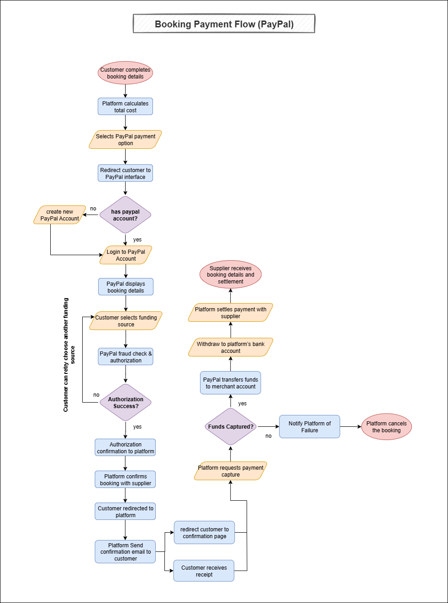
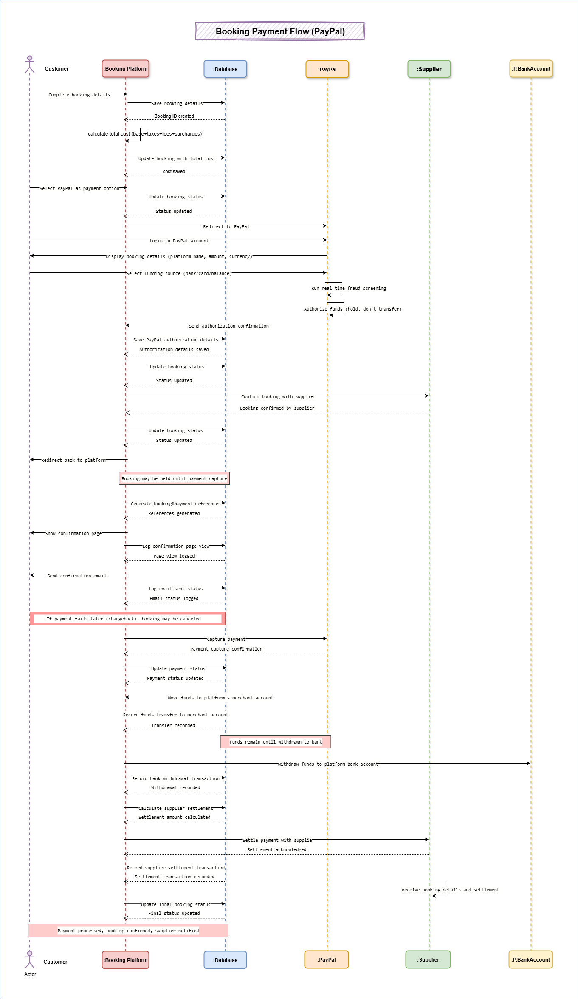

# Payment Integration – Use Case Documentation

This repository contains comprehensive documentation for the **Payment Integration (with PayPal)** use case of a Hotel/Flight Booking Platform. It includes the complete flow description, visual representations, data modeling, and supporting pseudocode and diagrams.

---

## Content List

1. [Overview](#overview)
2. [Use Case Flows](#use-case-flows) 
3. [Flowchart Diagram](#flowchart-diagram)
4. [Sequence Diagram](#sequence-diagram)
5. [Pseudocode](#pseudocode)
6. [Entity Relationship Diagram (ERD)](#entity-relationship-diagram-erd)
7. [Data Model Description](#data-model-description)
8. [Database Schema (PostgreSQL Compatible)](#database-schema-postgresql-compatible)

---

## Overview

The PayPal integration allows customers to securely pay for hotel or flight bookings using their PayPal balance, linked bank account, or card, without sharing payment details with the platform.
Once authorized, the payment is confirmed, the booking is finalized, and a receipt containing both payment and booking details is provided.
This process ensures secure transactions, supports multi-currency payments, reduces compliance overhead, and streamlines settlement between the booking platform and its hotel or airline partners.
This documentation presents the full flow and core logic of the Place Order use case, including business rules, interaction diagrams, data entities, and implementation-ready pseudocode.

---

## Use Case Flows

### `Actors`  
- **Customer** – The traveler making the booking
- **Booking Platform** – The intermediary marketplace handling bookings and payments
- **PayPal** – The payment service provider facilitating secure transactions
- **Supplier (Hotel/Airline)** – The actual service provider
- **Payment Processors** – Banks or institutions that handle transaction settlement for merchants

### `Main Flow : Payment Flow with PayPal in a Booking Platform` 
#### Goal : 
Enable customers to pay for hotel or flight bookings using PayPal in a secure, reliable, and trackable manner.

#### **Precondition** : 
- Booking platform has integrated PayPal’s payment API.
- Customer has selected a service (hotel room, flight, etc.) and filled in booking details.
- Customer completes booking details (dates, room type, passenger info)
- Platform calculates total cost (base price + taxes + fees + surcharges)

#### **Flow Steps** : 
1. Customer selects PayPal from available payment options
2. Platform redirects to PayPal’s secure interface
3. Customer login to paypal account
4. PayPal displays booking details (platform name, amount, currency)
5. Customer selects funding source (bank account, credit card, PayPal balance)
6. PayPal runs real-time fraud screening
7. PayPal authorizes funds (but does not transfer yet)
8. PayPal sends authorization confirmation to the platform
9. Platform confirms booking with supplier & redirects customer back
10. Booking may be held until payment capture is completed
11. Confirmation page shows:
  - Booking reference & details
  - Payment reference
  - Receipt download link
 12. Automated confirmation email sent to customer
  - If later payment fails (e.g., chargeback), booking may be canceled with penalties
13. Platform captures payment from PayPal
14. PayPal moves funds to the platform’s merchant account
15. Funds remain there until withdrawn to the platform’s bank account
16. Platform settles payment with supplier (minus commission)
17. Supplier receives booking details and settlement

**Postcondition**:  
- Payment successfully processed and funds transferred
- Customer receives confirmed booking and receipt
- Supplier receives booking details and settlement

---

## Flowchart Diagram



---

## Sequence Diagram

 

---

## Pseudocode

 **Will be added soon.**

---

## Entity Relationship Diagram (ERD)

 **Will be added soon.**

---

## Data Model Description

### `customer`

Stores customer details for bookings.

* `customer_id` (PK)
* `customer_type` – guest / user
* `first_name`, `last_name`, `email`, `phone_number`, `date_of_birth`, `gender`, `nationality`
* `country_id`
* `is_active`, `created_at`, `updated_at`

---

### `hotel`

Stores hotel information and approval status.

* `hotel_id` (PK)
* `hotel_name`, `hotel_code`, `logo_url`
* `location` (JSON), `geo_location` (GIS Point)
* `email`, `phone`
* `approval_status` – pending / approved / rejected
* `is_active`, `deactivation_info`, `activation_info`
* `total_rating`, `rating_count`, `average_rating`
* `approved_at`, `rejected_at`
* `created_at`, `updated_at`

---

### `hotel_room`

Contains details of each room within a hotel.

* `room_id` (PK)
* `hotel_id` (FK → `hotel.hotel_id`)
* `room_type`, `room_number`, `capacity` (number of guests)
* `price_per_night`, `currency`
* `is_available`, `created_at`, `updated_at`

---

### `airlines`

Stores airline information.

* `airline_id` (PK)
* `airline_name`, `airline_code` (IATA, unique)
* `logo_url`, `country_code`
* `is_active`, `created_at`, `updated_at`

---

### `flight`

Stores flight information.

* `flight_id` (PK)
* `airline_id` (FK → `airlines.airline_id`)
* `flight_number` (unique)
* `departure_airport`, `arrival_airport` (IATA code)
* `departure_time`, `arrival_time`
* `seat_capacity` – total seats available
* `booked_seats` – number of booked seats excluding lap infants
* `base_price`, `currency`
* `status` – scheduled / delayed / cancelled / completed
* `created_at`, `updated_at`

> **Note:** Only `adult` and `child` count toward `booked_seats`.

---

### `booking`

Represents a booking (hotel or flight).

* `booking_id` (PK)
* `confirmation_number`, `pin_code`
* `customer_id` (FK → `customer.customer_id`)
* `booking_reference`
* `booking_type` – hotel / flight
* `booking_status` – pending / confirmed / cancelled / completed / refunded
* `subtotal`, `tax_amount`, `service_fee`, `discount_amount`, `total_amount`
* `currency`
* `confirmation_info` (JSON), `cancellation_info` (JSON)
* `created_at`, `updated_at`

---

### `hotel_booking`

Details of hotel-specific bookings.

* `hotel_booking_id` (PK)
* `booking_id` (FK → `booking.booking_id`, unique)
* `hotel_id` (FK → `hotel.hotel_id`)
* `room_id` (FK → `hotel_rooms.room_id`)
* `check_in_date`, `check_out_date`, `nights`
* `payment_option` – pay\_at\_property / scheduled / immediate
* `payment_due_date`

---

### `flight_booking`

Details of flight-specific bookings.

* `flight_booking_id` (PK)
* `booking_id` (FK → `booking.booking_id`)
* `flight_id` (FK → `flight.flight_id`)
* `passenger_type` – adult / child / infant
* `seat_class` – economy / premium\_economy / business / first
* `seat_number`
* `ticket_type` – standard / flexible
* `ticket_price`
* `passenger_title`, `passenger_first_name`, `passenger_last_name`
* `passenger_date_of_birth`
* `document_number`, `document_expiry`, `document_issue_country`
* `nationality`
* `created_at`, `updated_at`

---

### `payment_method`

Supported payment methods (PayPal, credit card, etc.).

* `payment_method_id` (PK)
* `method_name`, `description`, `icon_url`
* `is_active`, `is_default`
* `created_at`, `updated_at`

---

### `payment_gateway`

Stores third-party gateway configurations.

* `gateway_id` (PK)
* `payment_method_id` (FK → `payment_method.payment_method_id`)
* `gateway_config` (JSONB)
* `created_at`, `updated_at`

---

### `transaction`

Stores transactions linked to bookings and payments.

* `transaction_id` (PK)
* `customer_id` (FK → `customer.customer_id`)
* `supplier_id` – hotel\_id or airline\_id
* `supplier_type` – hotel / airline
* `booking_id` (FK → `booking.booking_id`)
* `payment_method_id` (FK → `payment_method.payment_method_id`)
* `amount`, `currency`
* `is_authorized`, `is_captured`
* `transaction_reference`, `payment_reference`
* `status` – initiated / pending / paid / failed / cancelled / refunded / partially\_refunded / expired
* `created_at`, `updated_at`

---

### `transaction_detail`

Logs request/response data per transaction.

* `transaction_detail_id` (PK)
* `transaction_id` (FK → `transaction.transaction_id`)
* `gateway_id`
* `action`
* `request_payload` (JSONB), `response_payload` (JSONB), `error_stack` (JSONB)
* `created_at`

---

### `transaction_status_log`

Tracks status history of transactions.

* `transaction_status_log_id` (PK)
* `transaction_id` (FK → `transaction.transaction_id`)
* `status`
* `created_at`

---

### `refund`

Stores refund requests and processing info.

* `refund_id` (PK)
* `transaction_id` (FK → `transaction.transaction_id`)
* `amount`
* `reason`, `status`
* `processed_at`, `created_at`

---

## Database Schema (PostgreSQL Compatible)

```sql

-- Customer
CREATE TABLE customer (
    customer_id SERIAL PRIMARY KEY,
    customer_type VARCHAR(10) CHECK (customer_type IN ('guest','user')),
    first_name VARCHAR(100) NOT NULL,
    last_name VARCHAR(100) NOT NULL,
    email VARCHAR(255) NOT NULL,
    phone_number VARCHAR(20) NOT NULL,
    date_of_birth DATE,
    gender VARCHAR(10) CHECK (gender IN ('male','female')),
    nationality VARCHAR(3),
    country_id INT NOT NULL,
    is_active BOOLEAN NOT NULL DEFAULT TRUE,
    created_at TIMESTAMP DEFAULT CURRENT_TIMESTAMP,
    updated_at TIMESTAMP DEFAULT CURRENT_TIMESTAMP
);

-- Hotel
CREATE TABLE hotel (
    hotel_id SERIAL PRIMARY KEY,
    hotel_name VARCHAR(255) NOT NULL,
    hotel_code VARCHAR(20) UNIQUE,
    logo_url VARCHAR(512) DEFAULT '',
    location JSONB NOT NULL,
    geo_location GEOGRAPHY(POINT, 4326) NOT NULL,
    email VARCHAR(255) DEFAULT '',
    phone VARCHAR(30) DEFAULT '',
    approval_status VARCHAR(20) CHECK (approval_status IN ('pending','approved','rejected')),
    is_active BOOLEAN NOT NULL DEFAULT TRUE,
    deactivation_info JSONB DEFAULT NULL,
    activation_info JSONB DEFAULT NULL,
    total_rating DECIMAL NOT NULL DEFAULT 0,
    rating_count INT NOT NULL DEFAULT 0,
    average_rating DECIMAL NOT NULL DEFAULT 0,
    approved_at TIMESTAMP DEFAULT NULL,
    rejected_at TIMESTAMP DEFAULT NULL,
    created_at TIMESTAMP NOT NULL DEFAULT CURRENT_TIMESTAMP,
    updated_at TIMESTAMP DEFAULT CURRENT_TIMESTAMP
);

 -- Hotel Room
CREATE TABLE hotel_room (
    room_id SERIAL PRIMARY KEY,
    hotel_id INT NOT NULL REFERENCES hotel(hotel_id),
    room_type VARCHAR(50) NOT NULL,         -- e.g. single, double, suite
    room_number VARCHAR(20),                -- optional internal code
    capacity INT NOT NULL,                  -- number of guests
    price_per_night DECIMAL(10,2) NOT NULL,
    currency VARCHAR(3) NOT NULL,
    is_available BOOLEAN NOT NULL DEFAULT TRUE,
    created_at TIMESTAMP DEFAULT CURRENT_TIMESTAMP,
    updated_at TIMESTAMP DEFAULT CURRENT_TIMESTAMP
);

-- Airlines
CREATE TABLE airlines (
    airline_id SERIAL PRIMARY KEY,
    airline_name VARCHAR(255) NOT NULL,
    airline_code VARCHAR(3) UNIQUE NOT NULL, -- IATA code
    logo_url VARCHAR(512) DEFAULT '',
    country_code VARCHAR(3),
    is_active BOOLEAN NOT NULL DEFAULT TRUE,
    created_at TIMESTAMP DEFAULT CURRENT_TIMESTAMP,
    updated_at TIMESTAMP DEFAULT CURRENT_TIMESTAMP
);

-- Flight
CREATE TABLE flight (
    flight_id SERIAL PRIMARY KEY,
    airline_id INT NOT NULL REFERENCES airlines(airline_id),
    flight_number VARCHAR(10) UNIQUE NOT NULL,  -- e.g. SV123
    departure_airport VARCHAR(3) NOT NULL,      -- IATA cod
    arrival_airport VARCHAR(3) NOT NULL,        -- IATA code
    departure_time TIMESTAMP NOT NULL,
    arrival_time TIMESTAMP NOT NULL,
    seat_capacity INT NOT NULL,
    base_price DECIMAL(10,2) NOT NULL,
    currency VARCHAR(3) NOT NULL,
    status VARCHAR(20) CHECK (status IN ('scheduled','delayed','cancelled','completed')) DEFAULT 'scheduled',
    created_at TIMESTAMP DEFAULT CURRENT_TIMESTAMP,
    updated_at TIMESTAMP DEFAULT CURRENT_TIMESTAMP
);

-- Booking
CREATE TABLE booking (
    booking_id SERIAL PRIMARY KEY,
    confirmation_number VARCHAR(20) UNIQUE,
    pin_code INT UNIQUE,
    customer_id INT REFERENCES customer(customer_id),
    booking_reference VARCHAR(20) UNIQUE NOT NULL,
    booking_type VARCHAR(20) CHECK (booking_type IN ('hotel','flight')) NOT NULL,
    booking_status VARCHAR(20) CHECK (booking_status IN ('pending','confirmed','cancelled','completed','refunded')) DEFAULT 'pending',
    subtotal DECIMAL(15,4) NOT NULL,
    tax_amount DECIMAL(15,4) DEFAULT 0.00,
    service_fee DECIMAL(15,4) DEFAULT 0.00,
    discount_amount DECIMAL(15,4) DEFAULT 0.00,
    total_amount DECIMAL(15,4) NOT NULL,
    currency VARCHAR(3) NOT NULL,
    created_at TIMESTAMP DEFAULT CURRENT_TIMESTAMP,
    updated_at TIMESTAMP DEFAULT CURRENT_TIMESTAMP,
    confirmation_info JSON,
    cancellation_info JSON,
    CONSTRAINT chk_positive_amounts CHECK (
        subtotal >= 0 AND tax_amount >= 0 AND total_amount >= 0
    )
);

-- Hotel booking
CREATE TABLE hotel_booking (
    hotel_booking_id SERIAL PRIMARY KEY,
    booking_id INT UNIQUE NOT NULL REFERENCES booking(booking_id),
    hotel_id INT NOT NULL REFERENCES hotel(hotel_id),
    room_id INT NOT NULL REFERENCES hotel_room(room_id),
    check_in_date DATE NOT NULL,
    check_out_date DATE NOT NULL,
    nights INT NOT NULL,
    payment_option VARCHAR(20) CHECK (payment_option IN ('pay_at_property','scheduled','immediate')) NOT NULL DEFAULT 'immediate',
    payment_due_date DATE
);

-- Flight booking
CREATE TABLE flight_booking (
    flight_booking_id SERIAL PRIMARY KEY,
    booking_id INT NOT NULL,
    flight_id INT NOT NULL REFERENCES flight(flight_id),
    passenger_type VARCHAR(10) CHECK (passenger_type IN ('adult','child','infant')) DEFAULT 'adult',
    seat_class VARCHAR(20) CHECK (seat_class IN ('economy','premium_economy','business','first')) DEFAULT 'economy',
    seat_number VARCHAR(5),
    ticket_type VARCHAR(20) CHECK (ticket_type IN ('standard','flexible')) DEFAULT 'standard',
    ticket_price DECIMAL(10,2) NOT NULL,
    passenger_title VARCHAR(10) CHECK (passenger_title IN ('Mr','Mrs','Ms','Miss','Mstr','Dr')) NOT NULL,
    passenger_first_name VARCHAR(100) NOT NULL,
    passenger_last_name VARCHAR(100) NOT NULL,
    passenger_date_of_birth DATE,
    document_number VARCHAR(20), -- passport num , id number
    document_expiry DATE,
    document_issue_country VARCHAR(20) NOT NULL,
    nationality VARCHAR(3),
    created_at TIMESTAMP NOT NULL DEFAULT CURRENT_TIMESTAMP,
    updated_at TIMESTAMP DEFAULT CURRENT_TIMESTAMP
);

-- Payment method
CREATE TABLE payment_method (
    payment_method_id SERIAL PRIMARY KEY,
    method_name VARCHAR(100) NOT NULL CHECK (CHAR_LENGTH(method_name) BETWEEN 2 AND 100),
    description TEXT DEFAULT '',
    icon_url VARCHAR(512) DEFAULT '',
    is_active BOOLEAN NOT NULL DEFAULT TRUE,
    is_default BOOLEAN NOT NULL DEFAULT FALSE,
    created_at TIMESTAMP NOT NULL DEFAULT CURRENT_TIMESTAMP,
    updated_at TIMESTAMP DEFAULT CURRENT_TIMESTAMP
);

-- Payment gateway
CREATE TABLE payment_gateway (
    gateway_id VARCHAR(36) PRIMARY KEY,
    payment_method_id INT REFERENCES payment_method(payment_method_id),
    gateway_config JSONB NOT NULL,
    created_at TIMESTAMP NOT NULL DEFAULT CURRENT_TIMESTAMP,
    updated_at TIMESTAMP DEFAULT CURRENT_TIMESTAMP
);

-- Transaction
CREATE TABLE transaction (
    transaction_id SERIAL PRIMARY KEY,
    customer_id INT NOT NULL REFERENCES customer(customer_id),
    supplier_id INT, -- hotel_id or airline_id
    supplier_type VARCHAR(20) CHECK (supplier_type IN ('hotel','airline')),
    booking_id INT NOT NULL REFERENCES booking(booking_id),
    payment_method_id INT NOT NULL REFERENCES payment_method(payment_method_id),
    amount DECIMAL(10,2) NOT NULL CHECK (amount >= 0.00),
    currency VARCHAR(3) NOT NULL,
    is_authorized BOOLEAN DEFAULT FALSE,
    is_captured BOOLEAN DEFAULT FALSE,
    transaction_reference VARCHAR(100) NOT NULL,
    payment_reference VARCHAR(100) NOT NULL,
    status VARCHAR(50) NOT NULL CHECK (status IN ('initiated','pending','paid','failed','cancelled','refunded','partially_refunded','expired')),
    created_at TIMESTAMP NOT NULL DEFAULT CURRENT_TIMESTAMP,
    updated_at TIMESTAMP DEFAULT CURRENT_TIMESTAMP
);

-- Transaction detail
CREATE TABLE transaction_detail (
    transaction_detail_id SERIAL PRIMARY KEY,
    transaction_id INT NOT NULL REFERENCES transaction(transaction_id),
    gateway_id VARCHAR(20) NOT NULL,
    action VARCHAR(20) NOT NULL,
    request_payload JSONB NOT NULL,
    response_payload JSONB NOT NULL,
    error_stack JSONB,
    created_at TIMESTAMP NOT NULL DEFAULT CURRENT_TIMESTAMP
);

-- Transaction status log
CREATE TABLE transaction_status_log (
    transaction_status_log_id SERIAL PRIMARY KEY,
    transaction_id INT NOT NULL REFERENCES transaction(transaction_id),
    status VARCHAR(50) NOT NULL CHECK (status IN ('initiated','pending','paid','failed','cancelled','refunded','partially_refunded','expired')),
    created_at TIMESTAMP NOT NULL DEFAULT CURRENT_TIMESTAMP
);

-- Refund
CREATE TABLE refund (
    refund_id SERIAL PRIMARY KEY,
    transaction_id INT NOT NULL REFERENCES transaction(transaction_id),
    amount DECIMAL(10,2) NOT NULL,
    reason TEXT,
    status VARCHAR(20) NOT NULL,
    processed_at TIMESTAMP,
    created_at TIMESTAMP DEFAULT CURRENT_TIMESTAMP
);


