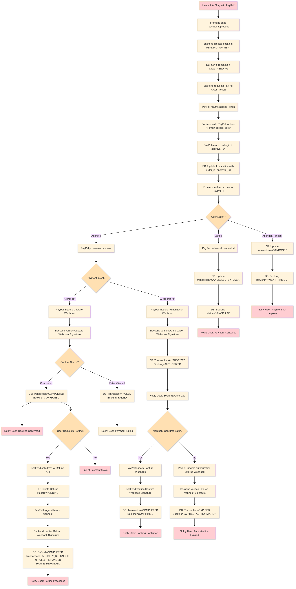

# **Payment Integration with PayPal - Documentation**

This document describes the integration of **PayPal payment** in the booking platform for hotel and flight reservations. It explains how payments are processed, tracked, and recorded using the **Strategy design pattern** to support multiple providers in the future.

The documentation includes:

* Overview of payment flows
* Detailed use case scenarios
* Pseudocode examples
* Entity Relationship Diagram (ERD)
* Database models and PostgreSQL-compatible schema

## **Table of Contents**

1. [Overview](#overview)
2. [Use Case Flows](#use-case-flows)

   * [Actors](#actors)
   * [Payment Flow Scenarios](#payment-flow-scenarios)

     * [1. Payment Completed Successfully](#1-payment-completed-successfully)
     * [2. Payment Failed](#2-payment-failed)
     * [3. Payment Cancelled by User](#3-payment-cancelled-by-user)
     * [4. Payment Authorized but Not Captured](#4-payment-authorized-but-not-captured)
     * [5. Refund Flow](#5-refund-flow)
     * [6. User Abandons Payment](#6-user-abandons-payment)
3. [Pseudocode](#pseudocode)
4. [Entity Relationship Diagram (ERD)](#entity-relationship-diagram-erd)
5. [Data Model Description](#data-model-description)
6. [Database Schema (PostgreSQL Compatible)](#database-schema-postgresql-compatible)

---

## **Overview**

The payment integration supports:

* PayPal payment flow (authorize, capture, refund)
* Transaction tracking for each booking
* Webhook handling for real-time payment updates
* Ability to extend to other payment providers

**Key concepts:**

* **Transaction**: Each payment attempt linked to a booking
* **Booking**: Represents hotel/flight reservation
* **Webhook**: Real-time notification from PayPal for payment/capture/refund events

---

## **Use Case Flows**

### **Actors**

* **Frontend (User Interface)**

  * Displays booking and payment options
  * Initiates payment requests to the backend
  * Redirects the user to PayPal for approval
  * Shows success, failure, or cancellation messages after payment

* **Backend (PaymentController, PaymentService, StrategyFactory)**

  * Handles all API requests from the frontend
  * Creates and updates booking records
  * Manages payment transactions
  * Selects the correct payment provider strategy (e.g., PayPal)
  * Calls external APIs (PayPal) and processes webhooks

* **PayPal (External Payment Gateway)**

  * Provides approval UI for the customer
  * Handles authentication and payment authorization/capture
  * Sends webhooks for order, capture, authorization, and refund events

* **Database (Persistence Layer)**

  * Stores booking records with current status (e.g., PENDING, CONFIRMED, CANCELLED)
  * Stores payment transactions and their lifecycle states (PENDING, AUTHORIZED, COMPLETED, FAILED, ABANDONED, REFUNDED)
  * Stores refund requests and results
  * Ensures consistency between booking lifecycle and payment lifecycle

### **Payment Flow Scenarios :**

### **1. Payment Completed Successfully**

**Goal:** To seamlessly finalize a payment via PayPal, confirm the funds have been captured, and update the system to reflect the confirmed booking.

**Precondition:** A user has selected a service, completed the booking form, and has chosen PayPal as their payment method. The system's PayPal integration is correctly configured with `intent=CAPTURE`.

**Detailed Flow:**

1.  The user clicks the **“Pay with PayPal”** button on the checkout page.
2.  The frontend application sends a request to the backend API endpoint `POST /api/payments/process`, containing the booking ID.
3.  The backend server updates the **Booking** status to `PENDING_PAYMENT` and creates a new **Transaction** record with a status of `PENDING`.
4.  The backend authenticates with PayPal by calling `POST /v1/oauth2/token` using the merchant's Client ID and Secret to obtain an `access_token`.
5.  Using this token, the backend calls the PayPal `POST /v2/checkout/orders` API with `intent: "CAPTURE"`, including amount, currency, and `redirect_urls`.
6.  PayPal responds with a `201 Created` status, a PayPal `order_id`, and an `approval_url`.
7.  The backend stores this `order_id` and `approval_url` against the Transaction record.
8.  The backend responds to the frontend with the `approval_url`, and the frontend redirects the user's browser to it.
9.  The user logs into PayPal and confirms the payment on PayPal's page.
10. Upon approval, PayPal redirects the user's browser back to the configured `returnUrl` (e.g., `https://example.com/payment/success`).
11. **In parallel**, PayPal sends an asynchronous `PAYMENT.CAPTURE.COMPLETED` webhook event to the backend's webhook listener (`POST /api/webhooks/paypal`).
12. The backend receives the webhook, verifies its cryptographic signature to confirm it's from PayPal, and extracts the details.
13. The backend updates the **Transaction** status to `COMPLETED` and the **Booking** status to `CONFIRMED`.
14. The frontend, now on the `returnUrl`, polls the backend or receives a notification. Upon detecting the `CONFIRMED` status, it displays a booking confirmation page.

**Postcondition:** The Transaction is `COMPLETED` and the Booking is `CONFIRMED`.

---

### **2. Payment Failed (Declined by PayPal)**

**Goal:** To gracefully handle a payment attempt that is declined by PayPal due to insufficient funds, invalid payment method, or other security reasons.

**Precondition:** The user has initiated a payment flow with a PayPal account or payment method that is invalid or cannot cover the charge.

**Detailed Flow:**

1.  The user clicks the **“Pay with PayPal”** button on the checkout page.
2.  The frontend application sends a request to the backend API endpoint `POST /api/payments/process`, containing the booking ID.
3.  The backend server updates the **Booking** status to `PENDING_PAYMENT` and creates a new **Transaction** record with a status of `PENDING`.
4.  The backend authenticates with PayPal by calling `POST /v1/oauth2/token` using the merchant's Client ID and Secret to obtain an `access_token`.
5.  Using this token, the backend calls the PayPal `POST /v2/checkout/orders` API with `intent: "CAPTURE"`, including amount, currency, and `redirect_urls`.
6.  PayPal responds with a `201 Created` status, a PayPal `order_id`, and an `approval_url`.
7.  The backend stores this `order_id` and `approval_url` against the Transaction record.
8.  The backend responds to the frontend with the `approval_url`, and the frontend redirects the user's browser to it.
9.  The user attempts to pay on the PayPal page, but PayPal's systems decline the transaction (e.g., due to insufficient funds).
10.  PayPal sends a `PAYMENT.CAPTURE.DENIED` webhook event to the backend's webhook listener.
11. The backend processes the webhook, finds the associated Transaction and Booking using the `order_id`, and updates their statuses.
12. The **Transaction** status is set to `FAILED`.
13. The associated **Booking** status is set to `FAILED`.
14. The frontend, which may be on a generic pending page, fetches the status and displays a "Payment failed. Please try a different method." error.

**Postcondition:** The Transaction is `FAILED` and the Booking is `FAILED`.

---

### **3. Payment Cancelled by User**

**Goal:** To handle the scenario where a user voluntarily aborts the payment process from within the PayPal interface.

**Precondition:** The user has started the PayPal checkout flow but decides not to complete the payment.

**Detailed Flow:**

1.  The user clicks the **“Pay with PayPal”** button on the checkout page.
2.  The frontend application sends a request to the backend API endpoint `POST /api/payments/process`, containing the booking ID.
3.  The backend server updates the **Booking** status to `PENDING_PAYMENT` and creates a new **Transaction** record with a status of `PENDING`.
4.  The backend authenticates with PayPal by calling `POST /v1/oauth2/token` using the merchant's Client ID and Secret to obtain an `access_token`.
5.  Using this token, the backend calls the PayPal `POST /v2/checkout/orders` API with `intent: "CAPTURE"`, including amount, currency, and `redirect_urls`.
6.  PayPal responds with a `201 Created` status, a PayPal `order_id`, and an `approval_url`.
7.  The backend stores this `order_id` and `approval_url` against the Transaction record.
8.  The backend responds to the frontend with the `approval_url`, and the frontend redirects the user's browser to it.
9.  On the PayPal page, the user clicks a **"Cancel and Return to Merchant"** button.
10.  PayPal redirects the user's browser to the configured `cancelUrl` (e.g., `https://example.com/payment/cancelled`).
11.  The page at the `cancelUrl` triggers logic to inform the backend of the cancellation, typically by calling an API like `POST /api/payments/{orderId}/cancel`.
12. The backend server receives this API call, finds the relevant Transaction and Booking, and updates them to reflect the user's choice.
13. The **Transaction** status is set to `CANCELLED_BY_USER`.
14. The associated **Booking** status is set to `CANCELLED`.
15. The frontend displays a message to the user: "Your payment was cancelled."

**Postcondition:** The Transaction is `CANCELLED_BY_USER` and the Booking is `CANCELLED`.

---

### **4. Payment Authorized but Not Captured (Delayed Capture)**

**Goal:** To authorize a user's funds without immediately capturing them, allowing for capture at a later date.

**Precondition:** The merchant's business model requires an authorization hold first.

**Detailed Flow:**

1.  The user clicks the **“Pay with PayPal”** button on the checkout page.
2.  The frontend application sends a request to the backend API endpoint `POST /api/payments/process`, containing the booking ID.
3.  The backend server updates the **Booking** status to `PENDING_PAYMENT` and creates a new **Transaction** record with a status of `PENDING`.
4.  The backend authenticates with PayPal by calling `POST /v1/oauth2/token` using the merchant's Client ID and Secret to obtain an `access_token`.
5.  **Critical Difference:** The backend calls `POST /v2/checkout/orders` with `intent: "AUTHORIZE"`.
6.  The backend stores this `order_id` and `approval_url` against the Transaction record.
7.  The backend responds to the frontend with the `approval_url`, and the frontend redirects the user's browser to it.
8.  The user approves the payment on PayPal, which authorizes the merchant to withdraw funds later.
9.  PayPal sends a `PAYMENT.AUTHORIZATION.CREATED` webhook to the backend.
10. The backend processes the webhook and updates the records:
    * The **Transaction** status is updated to `AUTHORIZED`.
    * The **Booking** status is updated to `AUTHORIZED`.
11. **Later Capture:** When the merchant decides to capture the funds (e.g., after service delivery), a backend process calls the PayPal `POST /v2/payments/authorizations/{auth_id}/capture` API.
12. Upon successful capture, PayPal sends a `PAYMENT.CAPTURE.COMPLETED` webhook.
13. The backend processes this webhook and updates the **Transaction** status to `COMPLETED` and the **Booking** status to `CONFIRMED`.
14. **Expiry Handling:** If the capture is not performed within ~29 days, PayPal voids the authorization and sends a `PAYMENT.AUTHORIZATION.VOIDED` webhook. The backend must handle this by updating the **Transaction** to `EXPIRED` and the **Booking** to `EXPIRED_AUTHORIZATION`.

**Postcondition:** The system holds an authorized payment that transitions to `COMPLETED` or `EXPIRED`.

---

### **5. Refund Flow**

**Goal:** To process a full or partial return of funds to the user after a booking has been paid for and confirmed.

**Precondition:** A booking with a status of `CONFIRMED` and a linked `COMPLETED` transaction exists.

**Detailed Flow:**

1.  A user or admin initiates a refund request via the frontend or dashboard.
2.  The frontend calls a backend endpoint like `POST /api/bookings/{id}/refund`.
3.  The backend validates the request and creates a **Refund** record with a status of `PENDING`, linked to the original transaction.
4.  The backend obtains a fresh PayPal OAuth `access_token`.
5.  The backend calls the PayPal Refund API: `POST /v2/payments/captures/{capture_id}/refund`.
6.  PayPal processes the refund and sends a `PAYMENT.REFUND.COMPLETED` webhook event upon completion.
7.  The backend verifies the webhook and updates the system:
    * The **Refund** record status is updated to `COMPLETED`.
    * The original **Transaction** status is updated to `REFUNDED`.
    * The **Booking** status is updated to `REFUNDED`.
8.  The frontend updates to show a confirmation that the refund has been processed.

**Postcondition:** The Transaction is `REFUNDED`, the Booking is `REFUNDED`, and funds are returned.

---

### **6. User Abandons Payment**

**Goal:** To handle incomplete payment flows where the user leaves the PayPal checkout page without taking action.

**Precondition:** A user has initiated a payment but fails to complete it.

**Detailed Flow:**

1.  The user clicks the **“Pay with PayPal”** button on the checkout page.
2.  The frontend application sends a request to the backend API endpoint `POST /api/payments/process`, containing the booking ID.
3.  The backend server updates the **Booking** status to `PENDING_PAYMENT` and creates a new **Transaction** record with a status of `PENDING`.
4.  The backend authenticates with PayPal by calling `POST /v1/oauth2/token` using the merchant's Client ID and Secret to obtain an `access_token`.
5.  Using this token, the backend calls the PayPal `POST /v2/checkout/orders` API with `intent: "CAPTURE"`, including amount, currency, and `redirect_urls`.
6.  PayPal responds with a `201 Created` status, a PayPal `order_id`, and an `approval_url`.
7.  The backend stores this `order_id` and `approval_url` against the Transaction record.
8.  The backend responds to the frontend with the `approval_url`, and the frontend redirects the user's browser to it.
9.  The user **abandons the process** by closing the browser tab, navigating away, or remaining idle. **No further interaction occurs.**
10.  **No webhook is received** from PayPal because the user never approved or denied the payment.
11.  A scheduled **cron job** on the backend runs periodically (e.g., every 30 minutes). This job searches for all Transaction records that have been in a `PENDING` state for longer than the timeout threshold (e.g., >30 minutes).
12. For each matching record, the cron job updates the statuses:
    * The **Transaction** status is set to `ABANDONED`.
    * The associated **Booking** status is set to `PAYMENT_TIMEOUT`.
13. This action may also release any reserved inventory associated with the booking.
14. If the user returns to the application, the frontend will display a message indicating the payment session timed out.

---

**Postcondition:** The Transaction is `ABANDONED` and the Booking is `PAYMENT_TIMEOUT`. System resources are cleaned up.
